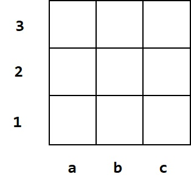
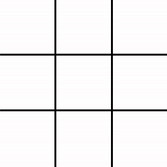
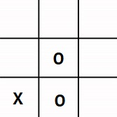

[TOC]

# 第一章 规则

本书采用FIDT规定的、统一的井字棋规范。下面将简单介绍。

## 简介

<table>
<tr>
    <td>
        

        
         
        图1-1
        

    </td>
    <td>
        

        
         
        图1-2
        

    </td>
    <td>
        

        
         
        图1-3
        

    </td>
</tr>
</table>

如图1-1所示，标准井字棋棋盘是一个九宫格，并且下方和左边标注着坐标。但是由于标准棋盘过于繁琐，通常省略边框和坐标，如图1-2。本书中几乎所有实例图都以简图的形式呈现。

井字棋的棋子有两种：O和X。FIDT规定先手为O，后手为X。棋子应摆在格内，如图1-3。

## 输赢判断

FIDT规定如有一方在棋盘内所占有的任意三格在一条直线上（仅包括横向、纵向、对角线），那么此棋手即为嬴，对方即为输。

和棋的情况有三种：
1. 棋盘已满但未分输嬴；
2. 双方同时认为之后的着法没有意义；
3. 一方以任何理由提出和棋且对方同意。

## 棋谱

同其他许多棋类一样，井字棋也使用坐标记谱。前面讲解标准棋盘时已涉及横纵坐标。如[图1-1](#1-1)，就像平面直角坐标系一样，先读横轴，再读纵轴。例如左下角的格记为a1，最中间的格记为b2。

记谱方式是一回合一换行，前面有回合号。此为皋锶争霸的经典棋局（皋执先）：

<strong>
    1 b2 a1   
    2 c3 c1   
    3 b1 b3   
    4 c2 a2 
    和棋条件二  
</strong>

